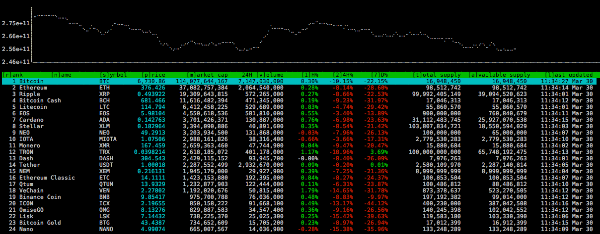

# cointop

> Coin tracking for hackers

[](https://raw.githubusercontent.com/miguelmota/cointop/master/LICENSE.md) [](https://goreportcard.com/report/github.com/miguelmota/cointop) [](https://godoc.org/github.com/miguelmota/cointop)



## Install

Make sure to have [golang](https://golang.org/) installed, then do:

```bash
go get -u github.com/miguelmota/cointop
```

## Usage

### Table commands

List of shortcuts:

|Key|Action|
|----|------|
|`<up>`|navigate up|
|`<down>`|navigate down|
|`<ctrl-u>`|page up|
|`<ctrl-d>`|page down|
|`<enter>`|visit highlighted coin on CoinMarketCap|
|`<space>`|alias to `<enter>`
|`j`|alias to `<down>`|
|`k`|alias to `<up>`|
|`r`|sort by *[r]ank*|
|`n`|sort by *[n]ame*|
|`s`|sort by *[s]ymbol*|
|`p`|sort by *[p]rice*|
|`m`|sort by *[m]arket cap*|
|`v`|sort by *24 hour [v]olume*|
|`1`|sort by *[1] hour change*|
|`2`|sort by *[2]4 hour change*|
|`7`|sort by *[7] day change*|
|`t`|sort by *[t]otal supply*|
|`a`|sort by *[a]vailable supply*|
|`l`|sort by *[l]ast updated*|
|`q`|[q]uit|
|`<esc>`|alias to quit|
|`<ctrl-c>`|alias to quit|

<!--
|`h`|toggle [h]elp|
|`?`|alias to help|
-->

## FAQ

- Q: Where is the data from?

  - A: The data is from [Coin Market Cap](https://coinmarketcap.com/).

- Q: What coins does this support?

  - A: This supports any coin listed on [Coin Market Cap](https://coinmarketcap.com/).

- Q: How often is the data polled?

  - A: Data gets polled once every minute by default.

- Q: I installed cointop without errors but the command is not found.

  - A: Make sure your `GOPATH` and `PATH` is set correctly.
    ```bash
    export GOPATH=$HOME/go
    export PATH=$PATH:$GOPATH/bin
    ```

## License

MIT
